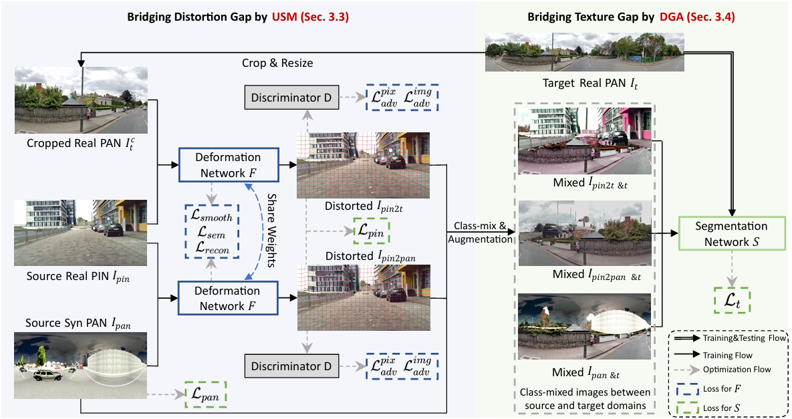

# Multi-Source Domain Adaptation for Panoramic Semantic Segmentation

> **Multi-Source Domain Adaptation for Panoramic Semantic Segmentation**<br>
> Information Fusion 2024<br>

<!-- [YouTube](https://www.youtube.com/watch?v=c55rRO-Aqac&ab_channel=JaeminNa)<br> -->

> **Abstract:** *Unsupervised domain adaptation methods for panoramic semantic segmentation utilize real pinhole images or low-cost synthetic panoramic images to transfer segmentation models to real panoramic images. However, these methods struggle to understand the panoramic structure using only real pinhole images and lack real-world scene perception with only synthetic panoramic images. Therefore, in this paper, we propose a new task, Multi-source Domain Adaptation for Panoramic Semantic Segmentation (MSDA4PASS), which leverages both real pinhole and synthetic panoramic images to improve segmentation on unlabeled real panoramic images. There are two key issues in the MSDA4PASS task: (1) distortion gaps between the pinhole and panoramic domains -- panoramic images exhibit global and local distortions absent in pinhole images; (2) texture gaps between the source and target domains -- scenes and styles differ across domains. To address these two issues, we propose a novel framework, Deformation Transform Aligner for Panoramic Semantic Segmentation (DTA4PASS), which converts all pinhole images in the source domains into distorted images and aligns the source distorted and panoramic images with the target panoramic images. Specifically, DTA4PASS consists of two main components: Unpaired Semantic Morphing (USM) and Distortion Gating Alignment (DGA). First, in USM, the Dual-view Discriminator (DvD) assists in training the diffeomorphic deformation network at the image and pixel level, enabling the effective deformation transformation of pinhole images without paired panoramic views, alleviating distortion gaps. Second, DGA assigns pinhole-like (pin-like) and panoramic-like (pan-like) features to each image by gating, and aligns these two features through uncertainty estimation, reducing texture gaps. DTA4PASS outperforms previous state-of-the-art methods by 1.92\% and 2.19\% in outdoor and indoor multi-source domain adaptation scenarios, respectively.*

## Table of Contents

- [Introduction](#Introduction)
- [Requirements](#Requirements)
- [Getting Started](#getting-started)
- [Reference](#Reference)
- [Citation](#Citation)

## Introduction



An overall illustration of the proposed DTA4PASS. To bridge the distortion gap between pinhole and panoramic images, USM (Sec. 3.3) converts all pinhole images into distorted images, referring to the source panoramic images $I_{pan}$ and the target panoramic images $I_{t}$. To bridge the texture gap between source and target images, DGA (Sec. 3.4) performs feature alignment between the class-mixed augmented source distorted/panoramic images and the target panoramic images.

## Requirements

- Linux
- Python
- PyTorch
- CUDA (must be a version supported by the pytorch version)
- run `pip install -e .` at `dta4pass` directory

## Getting Started

### preparation

Following [Trans4PASS](https://github.com/jamycheung/Trans4PASS) to prepare datasets. 
Following [Trans4PASS](https://github.com/jamycheung/Trans4PASS) to prepare pretrained SegFormer, and put it into

```
pretrained/
└── mit_b2.pth
```

### pretrain with source domains

Download official checkpoint from [gdrive](https://drive.google.com/drive/folders/1KecaSDNXSx5rVdNnbubMuwnSStNLVw7K?usp=sharing) or train it yourself:

Please change the corresponding path in [segmentron/data/dataloader/](segmentron/data/dataloader/)

For outdoor settings:

```bash
bash remote_pretrain.sh tools/pretrain_cs13_sp13.py configs/cs13_sp13/trans4pass_plus_small_512x512.yaml "0,1,2,3"
```

For indoor settings:

```bash
bash remote_pretrain.sh tools/pretrain_spin8_s3d8.py configs/spin8_s3d8/trans4pass_plus_small_512x512.yaml "0,1,2,3"
```

The results are saved at [workdirs](workdirs)

### domain adaptation

Attention!!! This process requires approximately 30GB of graphics card memory. The experiment was conducted using A100 with 40GB of memory.

Please change the corresponding path in [adaptations/train_da_outdoor.py](adaptations/train_da_outdoor.py) and [adaptations/train_da_indoor.py](adaptations/train_da_indoor.py)

For outdoor settings:

```bash
cd adaptations
CUDA_VISIBLE_DEVICES=0 python train_da_outdoor.py --snapshot-dir=try
```

For indoor settings:

```bash
cd adaptations
CUDA_VISIBLE_DEVICES=0 python train_da_indoor.py --snapshot-dir=try
```

The results are saved at [adaptations/snapshots/](adaptations/snapshots/)

### test

Download checkpoints provided by us in [gdrive](https://drive.google.com/drive/folders/1KecaSDNXSx5rVdNnbubMuwnSStNLVw7K?usp=sharing)

For outdoor settings:

```bash
CUDA_VISIBLE_DEVICES=0 python adaptations/evaluate_outdoor.py --restore-from /home/jjiang/experiments/dta4pass/official_pretrained/outdoor_da_57.16.pth
```

For indoor settings:

```bash
CUDA_VISIBLE_DEVICES=0 python adaptations/evaluate_indoor.py --restore-from /home/jjiang/experiments/dta4pass/official_pretrained/indoor_da_70.29.pth
```

## Reference

We appreciate the previous open-source works.

- [Trans4PASS](https://github.com/jamycheung/Trans4PASS)
- [TransMorph](https://github.com/junyuchen245/TransMorph_Transformer_for_Medical_Image_Registration)

## Citation

If you find DTA4PASS useful in your research, please consider citing:

```bibtex
@article{jiang2025multi,
  title={Multi-source domain adaptation for panoramic semantic segmentation},
  author={Jiang, Jing and Zhao, Sicheng and Zhu, Jiankun and Tang, Wenbo and Xu, Zhaopan and Yang, Jidong and Liu, Guoping and Xing, Tengfei and Xu, Pengfei and Yao, Hongxun},
  journal={Information Fusion},
  volume={117},
  pages={102909},
  year={2025},
  publisher={Elsevier}
}
```
